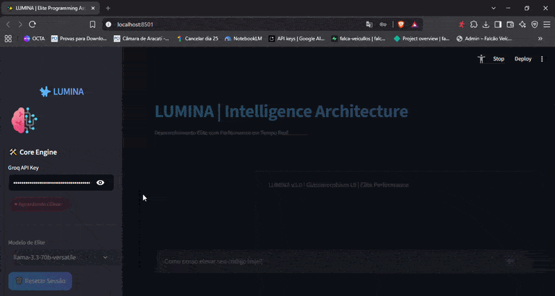

# ✨ LUMINA | Intelligence Architecture

<div align="center">
  
  <h3>Elite Programming Assistant with Glassmorphism UI</h3>
</div>


A **LUMINA** é uma assistente de inteligência artificial de elite, desenvolvida para elevar o nível técnico de programadores. Utilizando a infraestrutura de ultra-alta velocidade da **Groq** e uma interface moderna baseada em **Glassmorphism**, a LUMINA fornece insights estratégicos, arquitetura de software e código de alta performance em tempo real.

---

## 📸 Preview & Demonstração

<div align="center">
  
  <p><em>Interface Glassmorphism com animações de entrada e streaming de resposta em tempo real.</em></p>
</div>

---

## 🚀 Funcionalidades Elite

- **Interface Glassmorphism**: Design moderno com efeitos de transparência, desfoque e animações fluidas de entrada.
- **Arquitetura de Resposta Sênior**: Respostas estruturadas com *Insight Estratégico*, *Elite Code* (PEP 8 + Type Hints), *Deep Dive* técnico e *Pro-Tips*.
- **Status de Conexão em Tempo Real**: Monitoramento ativo da API Key com indicadores visuais pulsantes.
- **Streaming de Resposta**: Visualização do pensamento da IA em tempo real para uma experiência dinâmica.
- **Multi-Model Support**: Seleção entre modelos de ponta como Llama 3.3 70B e Mixtral 8x7B.

---

## 🛠️ Tecnologias Utilizadas

- **Linguagem**: [Python 3.11+](https://www.python.org/ )
- **Interface**: [Streamlit](https://streamlit.io/ )
- **Motor de IA**: [Groq Cloud API](https://console.groq.com/ )
- **Estilização**: CSS3 Customizado com animações e Glassmorphism.

---

## 📦 Como Instalar e Executar

1. **Clone o repositório:**
   ```bash
   git clone https://github.com/seu-usuario/lumina-elite-assistant.git
   cd lumina-elite-assistant
